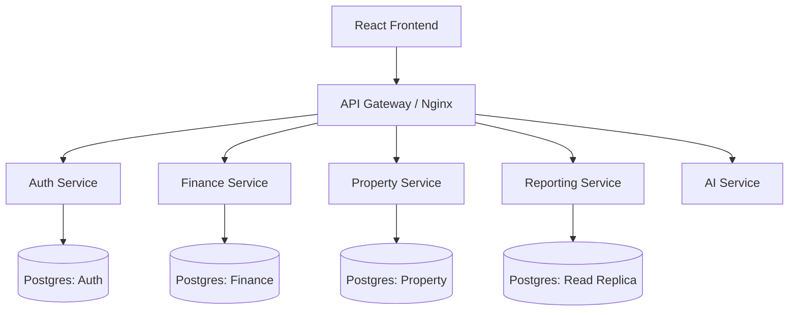

# Architecture Review - Personal Finance Dashboard

## 1. Executive Summary
This document outlines the architecture for the **Personal Finance Dashboard**, a local-first, microservices-based web application designed to replace manual Excel tracking. The system is built for privacy, longevity, and extensibility, using industry-standard enterprise patterns (Docker, Microservices, CDC) scaled down for personal use.

## 2. Goals & Objectives
- **Privacy First**: All data resides locally on the user's machine (Docker/Postgres). No external cloud dependency.
- **Automation**: Intelligent parsing of bank statements (ASB, ANZ, KiwiBank) to reduce manual entry.
- **Accuracy**: Double-entry accounting principles, CDC (Change Data Capture) for audit trails, and automated reconciliation.
- **Insights**: Real-time dashboards for Net Worth, Cash Flow, and Tax Obligations (Property-specific P&L).

## 3. High-Level Architecture
The system follows a **Microservices Architecture** orchestrated via Docker Compose.

### 3.1 Diagram

### 3.2 Services Breakdown
| Service | Tech Stack | Responsibility | Key Features |
| :--- | :--- | :--- | :--- |
| **Gateway** | Express / Nginx | Routing, Rate Limiting | Unified API Entry (`/api/*`) |
| **Auth** | Node, Express, Prisma | Identity, RBAC | JWT, Argone2, User Locking |
| **Finance** | Node, Express, Prisma | Core Banking | Parsing Engine, Transaction Ledger |
| **Property** | Node, Express, Prisma | Asset Management | Mortgage calc, Insurance, Tax |
| **Reporting**| Node, Express, Prisma | Analytics | Aggregation, Visualizations |
| **AI Agent** | Node, Express, LangChain| Intelligence | **Ollama (Local LLM)**, Chat, Auto-Categorization |

## 4. Data Strategy
### 4.1 Database Design (PostgreSQL)
- **Isolation**: Each service owns its schema (logical separation).
- **History (CDC)**: Critical tables (`Transaction`, `Asset`, `Budget`) implement **Type 2 Slowly Changing Dimensions**.
  - Columns: `valid_from`, `valid_to`, `is_current`.
  - Benefit: precise "point-in-time" reporting (e.g., "What was my Net Worth on Jan 1st?").

### 4.2 File Handling
- **Uploads**: Bank statements stored in `server/temp` -> Processed -> Archives/Deleted.
- **Privacy**: No file data sent to cloud.

## 5. Security Architecture
- **Authentication**: JWT (JSON Web Tokens) with short expiry + Refresh Tokens.
- **Authorization**: Role-Based Access Control (RBAC).
  - **Admin**: Full Access.
  - **User**: Read-only / Personal View.
- **Privacy Mode**: UI-level masking of sensitive digits (`$****`).

## 6. Implementation Guidelines
- **Monorepo**: All code in one repo for easier local dev management.
- **Docker**: `docker-compose up` spins up the entire world.
- **Testing**:
  - **Unit**: Vitest (Logic).
  - **Integration**: Supertest (API).
  - **Contract**: Pact (Service-to-Service).
  - **E2E**: Playwright (User Flows).

## 7. Future Considerations
- **Mobile App**: API is ready for a React Native mobile client.
- **AI Insights**: Architecture allows plugging in an LLM service for "Spending Advice".
